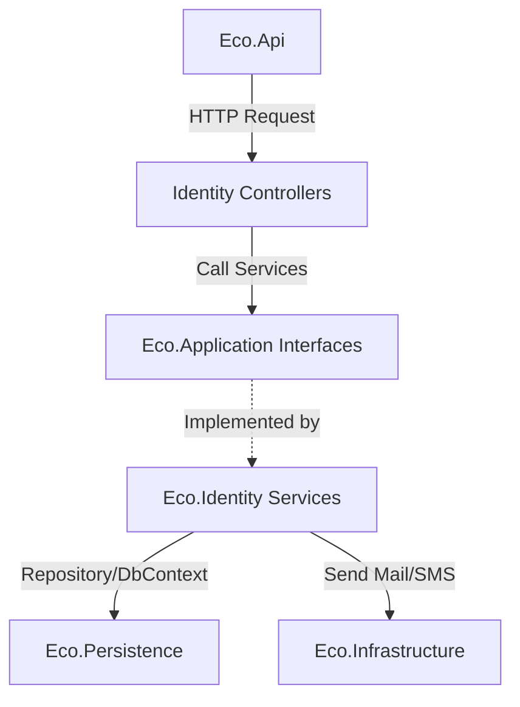

# Phân tích Dự án & Bản thiết kế Hệ thống Identity (Eco)

Tài liệu này phân tích chi tiết cấu trúc dự án backend hiện tại của **Eco** và đề xuất kiến trúc/phương án triển khai hệ thống **Identity hoàn chỉnh** dựa trên cấu trúc các Entity đã có.

---

## 1. Tổng quan Kiến trúc Dự án hiện tại
Dự án được tổ chức theo mô hình **Clean Architecture / Layered Architecture** gồm các dự án thành viên sau:

*   **`Eco.Api`**: Cổng giao tiếp API (Presentation Layer), cấu hình Middleware, Swagger, Endpoints, Dependency Injection.
*   **`Eco.Application`**: Chứa Business Logic (Interfaces, DTOs, CQRS - MediatR nếu áp dụng, Mappers, Validators).
*   **`Eco.Domain`**: Chứa các Enterprise Logic (Entities, Value Objects, Enums, Domain Exceptions).
*   **`Eco.Persistence`**: Tầng dữ liệu tương tác với Database (Entity Framework Core DbContext, Configurations, Migrations).
*   **`Eco.Infrastructure`**: Chứa các services kết nối bên ngoài (Email Sender, File Storage, SMS Service, v.v.).
*   **`Eco.Identity`**: Nơi triển khai logic nghiệp vụ liên quan đến xác thực và phân quyền (Authentication & Authorization).
*   **`Eco.Shared`**: Chứa các tiện ích, hằng số, lớp dùng chung cho toàn bộ solution.
*   **`Eco.BackgroundJobs`**: Xử lý các tác vụ nền (Hangfire/Quartz).

---

## 2. Phân tích Chi tiết cấu trúc Identity hiện tại

Hệ thống Identity trong dự án là một **hệ thống tự thiết kế (Custom Identity)** kế thừa từ `BaseEntity` với khóa chính dạng `Guid`, không sử dụng thư viện mặc định `Microsoft.AspNetCore.Identity`. Điều này mang lại sự linh hoạt tối đa nhưng đòi hỏi phải tự xây dựng toàn bộ logic quản lý.

### 2.1. Danh sách Domain Entities (`Eco.Domain/Entities/Identities`)
Dưới đây là phân tích vai trò của 15 thực thể đang có sẵn trong Domain:

| STT | Thực thể (Entity) | Vai trò & Chức năng |
| :--- | :--- | :--- |
| 1 | **`User`** | Tài khoản người dùng cơ bản (Username, Email, PasswordHash, Phone, Verification status, Lockout logic). |
| 2 | **`UserProfile`** | Thông tin chi tiết cá nhân (Họ tên, Avatar, Ngày sinh, Địa chỉ...) tách biệt để tối ưu hóa truy vấn tài khoản. |
| 3 | **`Role`** | Vai trò hệ thống (Admin, User, Manager...). |
| 4 | **`Permission`** | Quyền hạn chi tiết (Ví dụ: `read:users`, `write:settings`). |
| 5 | **`UserRole`** | Bảng trung gian liên kết Nhiều-Nhiều giữa `User` và `Role`. |
| 6 | **`RolePermission`** | Bảng trung gian liên kết Nhiều-Nhiều giữa `Role` và `Permission`. |
| 7 | **`UserPermission`** | Quyền trực tiếp gán cho User cụ thể (ghi đè hoặc bổ sung không qua Role). |
| 8 | **`RefreshToken`** | Quản lý token gia hạn phiên đăng nhập JWT (Token, Expires, Created/Revoked info). |
| 9 | **`UserSession`** | Theo dõi các phiên đăng nhập hoạt động của User (Device, IP Address, LastActive). |
| 10 | **`ExternalLogin`** | Hỗ trợ đăng nhập bên thứ 3 (Google, Facebook, GitHub...). |
| 11 | **`EmailVerification`** | Mã xác thực/token kích hoạt tài khoản qua Email. |
| 12 | **`PasswordReset`** | Token khôi phục mật khẩu khi quên. |
| 13 | **`Otp`** | Mã OTP dùng một lần cho xác thực 2 lớp (2FA) hoặc giao dịch bảo mật. |
| 14 | **`LoginHistory`** | Ghi nhận lịch sử đăng nhập (thành công/thất bại, IP, thiết bị) để phân tích bảo mật. |
| 15 | **`Subscription`** | Gói thuê bao/đăng ký dịch vụ của tài khoản (Hạng thành viên, thời hạn hết hạn). |

### 2.2. Cấu hình EF Core (`Eco.Persistence`)
*   `EcoDbContext` đã khai báo đầy đủ các `DbSet` tương ứng với các thực thể trên.
*   Toàn bộ cấu hình mối quan hệ, ràng buộc (Khóa ngoại, Index, Cascade Delete, độ dài dữ liệu) đã được cấu trúc rõ ràng trong thư mục `Configurations/Identity/`.

---

## 3. Kiến trúc Đề xuất cho Eco.Identity

Để hoàn thiện dự án Identity này, chúng ta cần triển khai các thành phần logic cốt lõi trong `Eco.Identity` và kết nối với các tầng khác.

### 3.1. Các dịch vụ cần xây dựng (Services Blueprint)

1.  **`IPasswordHasher`**:
    *   Hàm băm mật khẩu bảo mật cao (sử dụng BCrypt hoặc PBKDF2).
2.  **`ITokenService`**:
    *   Tạo Access Token (JWT) chứa Claims (UserId, Username, Roles, Permissions).
    *   Tạo và quản lý Refresh Token.
3.  **`IAuthenticationService`**:
    *   **Login**: Xác thực Username/Password, kiểm tra Lockout, kiểm tra EmailVerified (nếu bắt buộc), ghi nhận `LoginHistory`, tạo Session.
    *   **Register**: Tạo User mới, tạo Profile trống, sinh mã `EmailVerification`, gửi email kích hoạt.
    *   **RefreshToken**: Xác thực RefreshToken cũ, thu hồi và sinh cặp Token mới (Access Token + Refresh Token).
    *   **Logout**: Thu hồi RefreshToken, đánh dấu hết hạn `UserSession`.
4.  **`IExternalAuthService`**:
    *   Xác thực Token từ Google/Facebook, tự động đăng ký User mới nếu chưa tồn tại trong hệ thống.
5.  **`IUserService` / `IUserProfileService`**:
    *   Cập nhật thông tin Profile, đổi mật khẩu, kích hoạt xác thực 2 lớp (2FA).
6.  **`IRolePermissionService`**:
    *   Quản lý phân quyền nâng cao (RBAC - Role-Based Access Control & PBAC - Permission-Based Access Control).
7.  **`IOtpService` / `IEmailVerificationService`**:
    *   Tạo, lưu trữ và xác thực các OTP/Token qua Email/SMS.

---

## 4. Kế hoạch Triển khai Từng bước (Roadmap)

### Bước 1: Xây dựng Cơ sở Hạ tầng Bảo mật (Security Core)
*   Cài đặt thư viện: `System.IdentityModel.Tokens.Jwt`, `Microsoft.AspNetCore.Authentication.JwtBearer`.
*   Viết Service mã hóa mật khẩu `PasswordHasher`.
*   Thiết lập JWT options trong `appsettings.json` và cấu hình JWT Authentication trong `Eco.Api`.

### Bước 2: Thiết lập Tương tác Database
*   Tạo Repository dùng chung hoặc thao tác trực tiếp qua `EcoDbContext` trong tầng `Eco.Identity` hoặc `Eco.Application`.
*   Cài đặt Logic tự động thêm thông tin Audit (`CreatedAt`, `CreatedBy`, `UpdatedAt`) kế thừa từ `BaseEntity`.

### Bước 3: Hiện thực hóa quy trình Auth Cơ bản
*   Viết tính năng Đăng ký (Register) & Đăng nhập (Login).
*   Sinh JWT Token kèm theo vai trò và danh sách các quyền hạn của User.
*   Viết API Endpoints trong `Eco.Api`.

### Bước 4: Hoàn thiện tính năng Mở rộng (Verify, Reset, OTP)
*   Tích hợp dịch vụ Gửi Mail (`IEmailSender`) ở tầng Infrastructure.
*   Hiện thực quy trình Kích hoạt Email và Quên mật khẩu / Đặt lại mật khẩu.
*   Triển khai OTP & xác thực 2 lớp (2FA).

### Bước 5: Phân quyền Nâng cao (Authorization)
*   Xây dựng Custom Authorization Handler / Requirement trong ASP.NET Core để kiểm tra Permissions trên từng API Endpoint bằng Custom Attribute (ví dụ: `[HasPermission("read:users")]`).

---

Tài liệu này cung cấp cái nhìn tổng quan và định hướng phát triển. Khi bạn sẵn sàng triển khai từng phần, hãy phản hồi lại để chúng ta bắt đầu viết code chi tiết!
