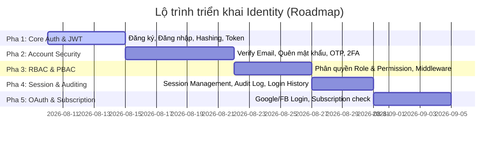
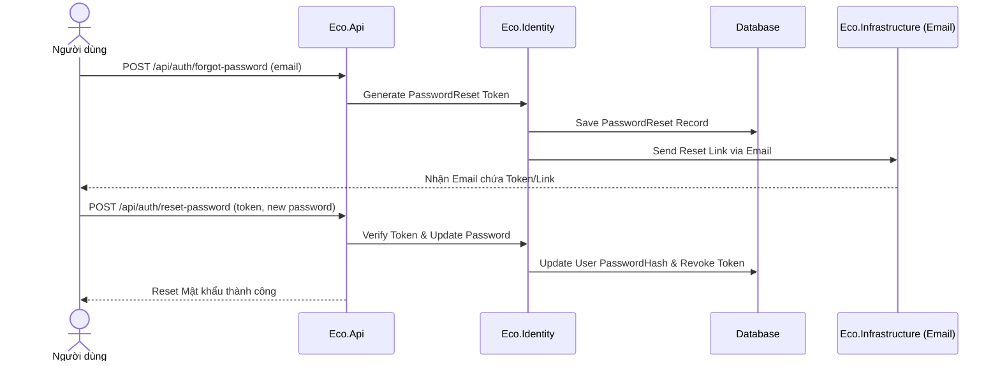

# Lộ Trình & Đặc Tả Chi Tiết Hệ Thống Identity (Eco)

Tài liệu này đóng vai trò là **Roadmap** kỹ thuật, mô tả chi tiết từng tính năng, luồng xử lý, đặc tả các API Endpoints và các Interface Service cần triển khai cho hệ thống Identity.

---

## 1. Bản Đồ Tính Năng (Feature Matrix) & Tiến Độ Triển Khai

Hệ thống Identity được chia làm 5 phân hệ chính với lộ trình tuần tự:



---

## 2. Đặc Tả Chi Tiết Từng Phân Hệ & Các API Endpoints

### Pha 1: Xác Thực Cơ Bản & Quản Lý Token (Core Auth & JWT)

#### 1. Đăng ký tài khoản (`POST /api/auth/register`)
*   **Mô tả**: Tạo tài khoản `User` và `UserProfile` mới ở trạng thái chưa kích hoạt.
*   **Payload nhận vào (DTO)**:
    ```json
    {
      "username": "hungnd",
      "email": "hung@example.com",
      "password": "SecurePassword123!",
      "fullName": "Nguyen Duy Hung",
      "phoneNumber": "0987654321"
    }
    ```
*   **Logic xử lý**:
    1.  Validate dữ liệu (Kiểm tra trùng lặp `Username`, `Email`).
    2.  Băm mật khẩu sử dụng `IPasswordHasher` (BCrypt).
    3.  Tạo Entity `User` (trạng thái `EmailVerified = false`, `IsLocked = false`).
    4.  Tạo Entity `UserProfile` liên kết với `User` qua `UserId`.
    5.  Sinh bản ghi `EmailVerification` chứa Token ngẫu nhiên (Hạn dùng 24h).
    6.  Publish sự kiện `UserRegisteredEvent` (để gửi mail kích hoạt ở Background Job).
*   **Kết quả trả về**: `201 Created` kèm thông báo đăng ký thành công, yêu cầu xác thực email.

#### 2. Đăng nhập hệ thống (`POST /api/auth/login`)
*   **Mô tả**: Xác thực thông tin đăng nhập, sinh Access Token (JWT) và Refresh Token.
*   **Payload nhận vào**:
    ```json
    {
      "usernameOrEmail": "hungnd",
      "password": "SecurePassword123!",
      "deviceInfo": "Chrome / Windows 11",
      "ipAddress": "192.168.1.1"
    }
    ```
*   **Logic xử lý**:
    1.  Tìm `User` theo Username hoặc Email.
    2.  Nếu không tồn tại hoặc bị Khóa (`IsLocked = true`), trả về `400 Bad Request`.
    3.  Kiểm tra mật khẩu qua `IPasswordHasher.Verify()`.
    4.  Nếu sai: Tăng `FailedLoginCount`. Nếu vượt quá 5 lần, đặt `IsLocked = true` trong 30 phút. Ghi nhận `LoginHistory` thất bại.
    5.  Nếu đúng: Reset `FailedLoginCount`. Cập nhật `LastLoginAt`.
    6.  Tạo bản ghi `UserSession` mới.
    7.  Sinh JWT Token chứa các Claims (UserId, Username, Roles, Permissions).
    8.  Sinh `RefreshToken` lưu xuống DB (hạn dùng 7 ngày).
    9.  Ghi nhận `LoginHistory` thành công.
*   **Kết quả trả về**:
    ```json
    {
      "accessToken": "eyJhbGciOi...",
      "refreshToken": "rf_token_value...",
      "expiresInSeconds": 3600
    }
    ```

#### 3. Làm mới Token (`POST /api/auth/refresh-token`)
*   **Mô tả**: Lấy Access Token mới bằng Refresh Token hợp lệ mà không cần đăng nhập lại.
*   **Payload nhận vào**:
    ```json
    {
      "refreshToken": "rf_token_value..."
    }
    ```
*   **Logic xử lý**:
    1.  Kiểm tra `RefreshToken` trong DB có tồn tại, chưa hết hạn, và chưa bị thu hồi (`IsRevoked`).
    2.  Lấy thông tin `User` liên kết.
    3.  Thu hồi token cũ (`IsRevoked = true`, cập nhật `RevokedAt`).
    4.  Tạo mới một `RefreshToken` khác (áp dụng cơ chế Rotate Token để bảo mật).
    5.  Tạo JWT Access Token mới.
*   **Kết quả trả về**: Cặp Access Token và Refresh Token mới.

---

### Pha 2: Bảo Mật Tài Khoản (Account Security)



#### 1. Kích hoạt tài khoản (`GET /api/auth/verify-email?token=...`)
*   Tìm bản ghi `EmailVerification` khớp với token. Kiểm tra hạn dùng.
*   Cập nhật `EmailVerified = true` trong bảng `User`. Xóa/đánh dấu đã sử dụng token.

#### 2. Quên mật khẩu & Đặt lại mật khẩu (`POST /api/auth/forgot-password` & `POST /api/auth/reset-password`)
*   **Forgot**: Sinh Token khôi phục ngẫu nhiên lưu vào `PasswordReset`, gửi mail hướng dẫn kèm link.
*   **Reset**: Nhận Token và mật khẩu mới, kiểm tra tính hợp lệ của Token, băm mật khẩu mới và cập nhật cho `User`.

#### 3. Xác thực hai lớp (`POST /api/auth/2fa/verify`)
*   Khi đăng nhập nếu bật 2FA, sinh mã OTP lưu vào `Otp` (hạn dùng 5 phút) gửi qua SMS hoặc Email.
*   Endpoint này kiểm tra mã OTP nhận vào để hoàn tất đăng nhập.

---

### Pha 3: Phân Quyền Hệ Thống (RBAC & PBAC)

#### 1. Quyền hạn (Permissions) và Vai trò (Roles)
*   **RBAC**: Gán `User` vào các `Role` thông qua `UserRole`.
*   **PBAC (Nâng cao)**:
    *   Mỗi `Role` chứa danh sách `Permission` (qua `RolePermission`).
    *   Hỗ trợ gán trực tiếp `Permission` cho `User` (qua `UserPermission`) để ghi đè (Allow/Deny) quyền cụ thể mà không cần đổi Role.

#### 2. Phân quyền Endpoint trong ASP.NET Core
*   Tạo một `PermissionAuthorizationHandler` kế thừa `AuthorizationHandler<PermissionRequirement>`.
*   Sử dụng Custom Attribute:
    ```csharp
    [Authorize(Policy = "Permission")]
    [HasPermission("read:users")]
    [HttpGet]
    public IActionResult GetProducts() { ... }
    ```

---

### Pha 4: Quản Lý Phiên & Giám Sát (Session & Auditing)

#### 1. Quản lý phiên hoạt động (`GET /api/sessions/active` & `DELETE /api/sessions/{id}`)
*   **List Active**: Lấy danh sách các session đang hoạt động của người dùng hiện tại từ bảng `UserSession` (bao gồm thiết bị, IP, thời gian hoạt động cuối).
*   **Revoke Session**: Cho phép người dùng đăng xuất từ xa một thiết bị bằng cách xóa session đó và thu hồi các `RefreshToken` liên quan.

#### 2. Lịch sử Đăng nhập & Audit Log (`GET /api/audit-logs`)
*   Ghi nhận nhật ký thay đổi dữ liệu nhạy cảm (Đổi mật khẩu, đổi quyền, khóa tài khoản) vào bảng `AuditLog`.

---

### Pha 5: Đăng Nhập Bên Thứ 3 & Gói Thành Viên (OAuth & Subscription)

#### 1. Đăng nhập Google/Facebook (`POST /api/auth/external-login`)
*   Nhận `Provider` (Google/Facebook) và `IdToken` từ Frontend.
*   Xác thực `IdToken` với API của Google/Facebook.
*   Liên kết với thực thể `ExternalLogin` trong hệ thống. Nếu là người dùng mới, tự động tạo tài khoản.

#### 2. Kiểm tra quyền hạn Gói Thành Viên (`Subscription`)
*   Mỗi User có thể liên kết với một `Subscription` (chứa thông tin gói VIP, Premium, Pro...).
*   Xây dựng Middleware/Filter kiểm tra hạn gói dịch vụ trước khi cho phép truy cập các tính năng nâng cao.

---

## 3. Đặc Tả các Interface Kỹ Thuật (Eco.Application)

Dưới đây là các Interface cốt lõi cần được định nghĩa ở lớp `Eco.Application` và hiện thực ở lớp `Eco.Identity`:

```csharp
// Tệp: d:\Hung\Eco\Eco_BE\src\Eco.Application\Common\Interfaces\Identity\IPasswordHasher.cs
public interface IPasswordHasher
{
    string Hash(string password);
    bool Verify(string password, string passwordHash);
}

// Tệp: d:\Hung\Eco\Eco_BE\src\Eco.Application\Common\Interfaces\Identity\ITokenService.cs
public interface ITokenService
{
    string GenerateAccessToken(User user, IEnumerable<string> roles, IEnumerable<string> permissions);
    string GenerateRefreshToken();
    ClaimsPrincipal GetPrincipalFromExpiredToken(string token);
}

// Tệp: d:\Hung\Eco\Eco_BE\src\Eco.Application\Common\Interfaces\Identity\IAuthenticationService.cs
public interface IAuthenticationService
{
    Task<AuthResponseDto> RegisterAsync(RegisterRequestDto request);
    Task<AuthResponseDto> LoginAsync(LoginRequestDto request);
    Task<AuthResponseDto> RefreshTokenAsync(RefreshTokenRequestDto request);
    Task<bool> RevokeTokenAsync(string refreshToken);
    Task<bool> VerifyEmailAsync(string token);
    Task<bool> ForgotPasswordAsync(string email);
    Task<bool> ResetPasswordAsync(ResetPasswordRequestDto request);
}
```

---

*Tài liệu này thiết lập bộ khung chức năng hoàn chỉnh cho quá trình phát triển hệ thống Identity của bạn.*
